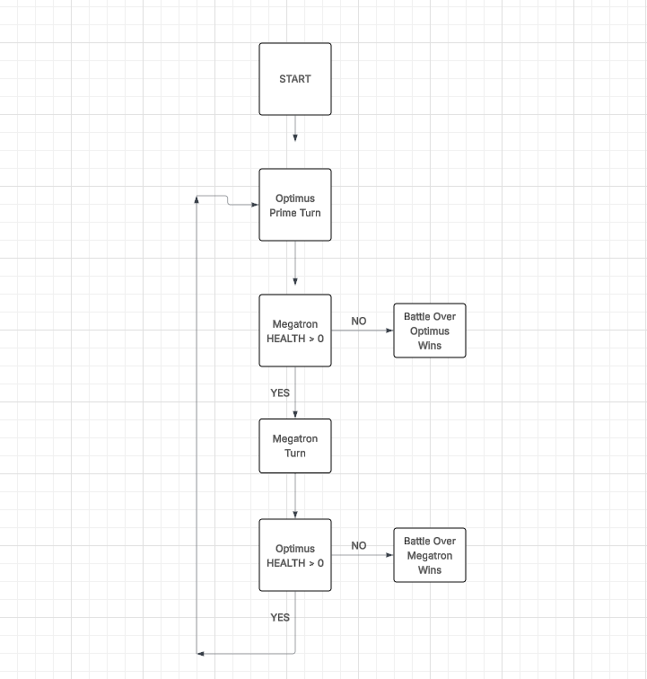

# War for Cybertron: Optimus Prime vs Megatron (MIA Task 8 - 2)

This project is a **C++ OOP simulation** of a fight between **Optimus Prime** and **Megatron**.  

Both warriors take turns attacking with different weapons, each with unique **damage** and **accuracy**. The fight continues until one of them falls.

---

## Weapons

### Optimus Prime
- **Ion Rifle** → Damage: 6, Accuracy: 100%  
- **Energon Swords** → Damage: 12, Accuracy: 80%  
- **Shoulder Cannon** → Damage: 45, Accuracy: 25%  

### Megatron
- **Fusion Cannon** → Damage: 9, Accuracy: 90%  
- **Fusion Sword** → Damage: 18, Accuracy: 70%  
- **Tank Mode** → Damage: 60, Accuracy: 15%  

---

## State Machine Diagram

